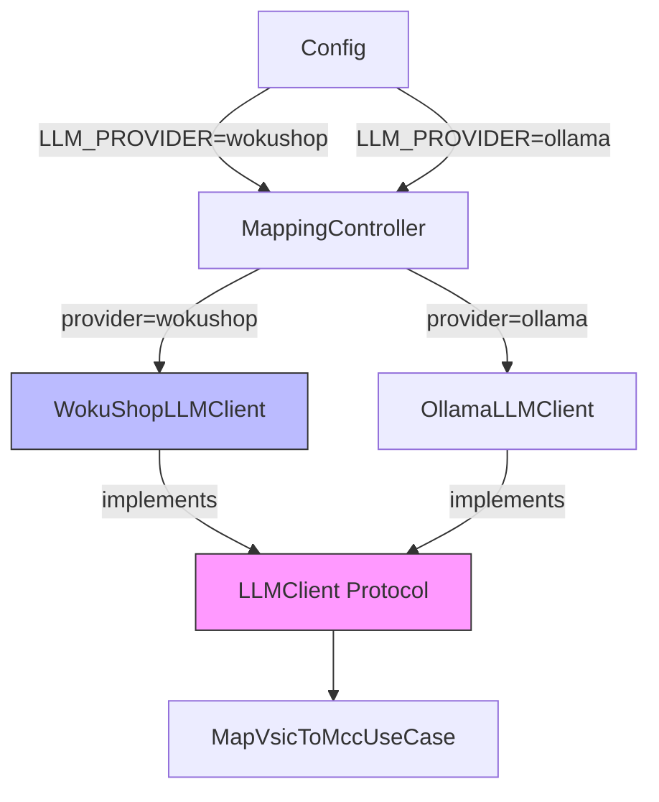

# Design — WokuShop LLM Provider

## Architecture Overview

Thêm một concrete implementation mới của `LLMClient` protocol, wired vào controller qua config. Use case và service không thay đổi.



## Components

### 1. `app/repositories/wokushop_llm_client.py` (NEW)

```python
class WokuShopLLMClient(LLMClient):
    def __init__(self, api_key: str, base_url: str, model: str, timeout: int = 120) -> None
    def chat(self, system: str, user: str, *, temperature: float = 0.0) -> str
    def health_check(self) -> bool
```

- Dùng `openai` SDK với `base_url=https://llm.wokushop.com/v1`.
- `response_format={"type": "json_object"}`, `temperature=0`.
- 3 retry với exponential backoff (2^attempt seconds) — giống `OllamaLLMClient`.
- `health_check()`: gọi `client.models.list()`, trả về `True`/`False`.
- Không bao giờ log `api_key`.

### 2. `app/config.py` (MODIFY)

Thêm các env vars:

| Env Var | Default | Description |
|---|---|---|
| `LLM_PROVIDER` | `ollama` | `ollama` hoặc `wokushop` |
| `WOKUSHOP_API_KEY` | — | API key, required khi provider=wokushop |
| `WOKUSHOP_BASE_URL` | `https://llm.wokushop.com/v1` | OpenAI-compatible endpoint |
| `WOKUSHOP_MODEL` | `gpt-4o` | Model name |

`Config.validate()` bổ sung: nếu `LLM_PROVIDER=wokushop` và `WOKUSHOP_API_KEY` trống → raise `ValueError`.

### 3. `app/controllers/mapping_controller.py` (MODIFY)

**`__init__`**: Thêm param `llm_provider: str = "ollama"`.

**`execute`**: Thay `check_ollama_models` và `OllamaLLMClient` bằng provider-aware logic:

```python
# Health check
if self.llm_provider == "wokushop":
    # Check embedding via Ollama (unchanged)
    check_ollama_embedding(self.ollama_host, self.embedding_model)
    # Check WokuShop
    if not wokushop_client.health_check():
        logger.error("WokuShop health check failed")
        return 2
else:
    check_ollama_models(self.ollama_host, self.llm_model, self.embedding_model)

# DI
if self.llm_provider == "wokushop":
    llm_client = WokuShopLLMClient(api_key=..., base_url=..., model=...)
else:
    llm_client = OllamaLLMClient(self.ollama_host, self.llm_model)
```

### 4. `app/services/ollama_health_check.py` (MODIFY — minimal)

Extract `check_ollama_embedding(host, model)` từ `check_ollama_models` để controller có thể check chỉ embedding khi provider=wokushop.

### 5. `main.py` (MODIFY)

Truyền `Config.LLM_PROVIDER` vào `MappingController`:

```python
controller = MappingController(
    ...
    llm_provider=Config.LLM_PROVIDER,
)
```

### 6. `requirements.txt` (MODIFY)

Thêm `openai>=1.0.0`.

## Data Flow (provider=wokushop)

```
startup:
  Config.validate() → fail-fast nếu API key trống
  check_ollama_embedding() → verify bge-m3 OK
  WokuShopLLMClient.health_check() → verify WokuShop reachable

per-VSIC (unchanged):
  OllamaEmbeddingClient.embed() → top-K candidates
  WokuShopLLMClient.chat(system, user) → JSON string
  _parse_llm_response() → top-3 MCCs
```

## Error Handling

| Scenario | Behavior |
|---|---|
| `WOKUSHOP_API_KEY` trống + provider=wokushop | `Config.validate()` raise ValueError trước khi chạy |
| WokuShop unreachable lúc startup | `health_check()` → controller return exit code 2 |
| HTTP 401 / 403 | Retry 3 lần → RuntimeError với message rõ |
| Non-JSON response | `_parse_llm_response` đã tolerant — không thay đổi |
| Network timeout | Retry với backoff 1s, 2s, 4s |

## Security

- `WOKUSHOP_API_KEY` chỉ đọc từ env, không hardcode, không log, không commit vào git.
- `.env` đã gitignore (kiểm tra trước khi commit).

## Testing Strategy

- Unit test `WokuShopLLMClient.chat()`: mock `openai.OpenAI`, verify message format, retry logic, error paths.
- Unit test `WokuShopLLMClient.health_check()`: mock `models.list()` success/failure.
- Unit test `Config.validate()` với `LLM_PROVIDER=wokushop` và key trống.
- Integration smoke-test (manual): 1 call thực với API key thật.

## Files Changed Summary

| File | Change |
|---|---|
| `app/repositories/wokushop_llm_client.py` | **NEW** — ~60 LOC |
| `app/config.py` | MODIFY — thêm 4 env vars + validate |
| `app/controllers/mapping_controller.py` | MODIFY — provider selection + health check |
| `app/services/ollama_health_check.py` | MODIFY — extract `check_ollama_embedding` |
| `main.py` | MODIFY — pass `llm_provider` to controller |
| `requirements.txt` | MODIFY — add `openai` |
| `tests/test_wokushop_llm_client.py` | **NEW** — unit tests |
| `.env.example` | MODIFY — document new env vars |
