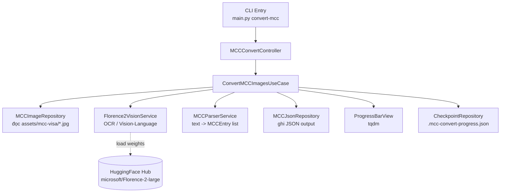

# System Design & Architecture

## Architecture Overview
**Cấu trúc hệ thống ở mức cao:**



### Thành phần và trách nhiệm
- **CLI Entry (`main.py`)**: Parse argparse, khởi động logging, gọi Controller.
- **Controller (`app/controllers/mcc_convert_controller.py`)**: Tiếp nhận tham số (input_dir, output_path, device…), điều phối Use Case, map exception thành exit code.
- **Use Case (`app/services/convert_mcc_images_use_case.py`)**: Orchestration thuần — lặp qua từng ảnh, gọi vision service, parser, writer, cập nhật progress. Không biết chi tiết Florence-2.
- **Florence-2 Vision Service (`app/services/florence2_vision_service.py`)**: Wrap `transformers.AutoModelForCausalLM` + `AutoProcessor`, expose hàm `extract_text(image_path) -> str`.
- **MCC Parser Service (`app/services/mcc_parser_service.py`)**: Chuyển text thô Florence-2 trả về thành `list[MCCEntry]`, dùng regex + heuristic.
- **Repositories**:
  - `MCCImageRepository`: Liệt kê/đọc ảnh từ thư mục input.
  - `MCCJsonRepository`: Ghi danh sách `MCCEntry` ra JSON (UTF-8, indent=2).
  - `CheckpointRepository`: Đọc/ghi/xóa checkpoint file (`.mcc-convert-progress.json`) — đặt cùng thư mục với output JSON. Ghi thêm tên ảnh sau mỗi lần thành công; xóa toàn bộ khi pipeline hoàn thành.
- **Views**: `ProgressBarView` bọc `tqdm` để Use Case không phụ thuộc trực tiếp thư viện UI.

### Công nghệ & lý do chọn
| Thành phần | Công nghệ | Lý do |
|---|---|---|
| Vision-Language | `transformers` + `torch` + Florence-2 large | Yêu cầu bắt buộc của Order; Florence-2 hỗ trợ OCR và grounding mạnh, license MIT. |
| CLI | `argparse` (stdlib) | Tránh thêm dependency; đủ cho use case đơn giản. |
| Progress bar | `tqdm` | Gọn nhẹ, quen thuộc, tích hợp tốt terminal; `rich` là lựa chọn thay thế nếu cần UI đẹp hơn. |
| Logging | `loguru` | Đã có trong `requirements.txt`. |
| Image I/O | `Pillow` | Florence-2 processor yêu cầu PIL Image. |
| Validation | `pydantic` | Đã có; dùng cho `MCCEntry` model. |

## Data Models
**Dữ liệu cần quản lý:**

### `MCCEntry` (domain model — `app/models/mcc_entry.py`)
```python
class MCCEntry(BaseModel):
    mcc_code: str                       # ví dụ "5411"; rỗng "" nếu không parse được
    title: str
    description: str
    similar_merchants: list[str] = []
    source_image: str                   # tên file ảnh nguồn (bắt buộc, provenance)
    _unparsed: bool = False             # True khi mcc_code = "" do parse thất bại
```

### Output JSON schema
- Một file tổng `mcc-visa.json` chứa `list[MCCEntry]` đã serialize.
```json
[
  {
    "mcc_code": "5411",
    "title": "Grocery Stores, Supermarkets",
    "description": "Merchants selling food...",
    "similar_merchants": ["Supermarkets", "Food Stores"],
    "source_image": "visa-merchant-data-standards-manual-hình ảnh-27.jpg",
    "_unparsed": false
  },
  {
    "mcc_code": "",
    "title": "",
    "description": "Page content could not be parsed",
    "similar_merchants": [],
    "source_image": "visa-merchant-data-standards-manual-hình ảnh-28.jpg",
    "_unparsed": true
  }
]
```

### Luồng dữ liệu
1. Repository liệt kê file `*.jpg` trong `input_dir` → `list[Path]`.
2. Nếu `--resume`: CheckpointRepository tải danh sách ảnh đã xong → bỏ qua trong vòng lặp.
3. Use Case lặp qua mỗi path → vision service trả về text thô.
4. Parser service tách text thành `list[MCCEntry]` (entry không parse được: `mcc_code=""`, `_unparsed=True`).
5. CheckpointRepository ghi tên ảnh vào checkpoint sau mỗi ảnh thành công.
6. Use Case gom tất cả entry, dedup **chỉ các entry có `_unparsed=False`** theo `mcc_code`; giữ nguyên tất cả entry `_unparsed=True`.
7. MCCJsonRepository ghi JSON; CheckpointRepository xóa checkpoint file.

## API Design
**Không có API HTTP** — giao tiếp duy nhất là CLI.

### CLI interface
```
python3 main.py convert-mcc \
  --input-dir assets/mcc-visa \          # default: assets/mcc-visa
  --output    out/mcc-visa.json \        # default: out/mcc-visa.json
  --device    auto \                     # auto | cpu | cuda  (default: auto)
  --resume                               # tiếp tục từ checkpoint (default: off)
```
Checkpoint file được đặt tự động tại `<output-dir>/.mcc-convert-progress.json`.

### Internal interfaces (abstractions — Dependency Rule)
```python
class VisionService(Protocol):
    def extract_text(self, image_path: Path) -> str: ...

class MCCParser(Protocol):
    def parse(self, text: str, source: str) -> list[MCCEntry]: ...

class ImageRepository(Protocol):
    def list_images(self, dir_path: Path) -> list[Path]: ...

class JsonRepository(Protocol):
    def save(self, entries: list[MCCEntry], output: Path) -> None: ...

class CheckpointRepository(Protocol):
    def load(self) -> set[str]: ...           # trả về set tên file đã xong
    def mark_done(self, filename: str) -> None: ...
    def clear(self) -> None: ...
```
Use Case phụ thuộc vào các Protocol trên (D trong SOLID), implementation cụ thể cho Florence-2 nằm ở `services/` & `repositories/`.

## Component Breakdown
**Các khối chính:**

- **Presentation layer**
  - `main.py` — subcommand `convert-mcc`.
  - `app/views/progress_bar_view.py` — wrap tqdm.
- **Controller layer**
  - `app/controllers/mcc_convert_controller.py`.
- **Use case / Service layer**
  - `app/services/convert_mcc_images_use_case.py`
  - `app/services/florence2_vision_service.py`
  - `app/services/mcc_parser_service.py`
- **Repository layer**
  - `app/repositories/mcc_image_repository.py`
  - `app/repositories/mcc_json_repository.py`
  - `app/repositories/checkpoint_repository.py`
- **Domain models**
  - `app/models/mcc_entry.py`
- **Third-party**
  - HuggingFace Hub (download weights lần đầu).

## Design Decisions
**Vì sao chọn cách này?**

1. **Tách Florence-2 thành service riêng sau Protocol**: Tôn trọng Dependency Inversion — tương lai có thể swap sang model khác (Qwen-VL, GPT-4V) mà không đổi Use Case.
2. **Parser tách khỏi Vision service**: Vì format output của Florence-2 phụ thuộc prompt task. Việc tách giúp tái dùng parser nếu đổi engine OCR, và dễ test bằng text fixture.
3. **Một file JSON tổng hợp**: Dễ consume cho feature mapping VSIC-to-MCC sau này. Chế độ per-file không thuộc V1 scope.
4. **Không abort khi 1 ảnh lỗi**: Pipeline log lỗi và tiếp tục — phù hợp yêu cầu và UX batch xử lý.
5. **`tqdm` thay vì `rich.progress`**: `tqdm` nhẹ hơn, không chiếm header/footer màn hình, đủ cho yêu cầu "loading bar".
6. **Alternatives considered:**
   - Dùng Tesseract OCR + LLM phụ parse: bị loại vì Order yêu cầu rõ Florence-2.
   - Dùng `click` cho CLI: bị loại để giảm dependency; argparse đủ dùng.

## Non-Functional Requirements
**Hiệu suất & chất lượng:**

- **Performance:**
  - Lazy-load Florence-2 (chỉ load khi bắt đầu batch); tái dùng instance cho toàn batch.
  - Cho phép half-precision (`torch.float16`) khi chạy CUDA để giảm VRAM.
- **Scalability:**
  - Hiện xử lý tuần tự; có thể mở rộng sang batch inference (nhiều ảnh/lần) nếu dataset tăng — không implement vòng đầu.
- **Security:**
  - Không có dữ liệu nhạy cảm; chỉ đọc ảnh local và ghi JSON local.
  - Pin phiên bản `transformers`, `torch` trong `requirements.txt` để tránh supply-chain drift.
- **Reliability:**
  - Exception trên 1 ảnh không làm crash toàn bộ; log `WARNING` kèm file name.
  - Trước khi ghi JSON, validate qua `MCCEntry` pydantic (fail-fast nếu thiếu field).
- **Observability:**
  - Log: số ảnh input, số entry parse thành công, số ảnh lỗi, tổng thời gian, device đang dùng.
