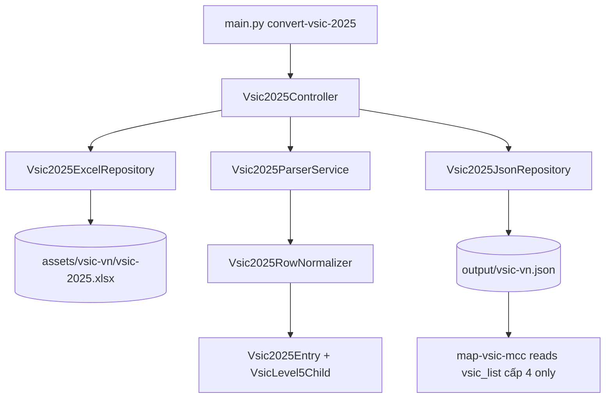

# System Design & Architecture

## Architecture Overview
**What is the high-level system structure?**

- Key components and responsibilities:
  - `Vsic2025ExcelRepository`: đọc sheet, map header `Cấp 1..5`, `Tên ngành` → dict trung gian.
  - `Vsic2025RowNormalizer`: nhận diện row cấp 4 vs cấp 5 từ cột D/E; chuẩn hóa `code`/`title` (string, không zero-pad).
  - `Vsic2025ParserService`: duyệt tuần tự, gom `children_level5` vào entry cấp 4 hiện tại.
  - `Vsic2025JsonRepository`: ghi wrapper JSON + nested `vsic_list`.
  - `Vsic2025Controller`: orchestrate; không dùng chung với `VsicController` của `convert-vsic`.
- Technology stack:
  - Tái sử dụng pattern Clean Architecture + Pydantic; openpyxl (hoặc reader hiện có) cho Excel.
  - **Không** auto-detect format; **không** sửa `convert-vsic` path.

## Data Models
**What data do we need to manage?**

- Input row (raw):
  - `{"cap_1": str|None, ..., "cap_5": str|None, "title": str|None}`
- Domain (service layer):
  - `VsicLevel5Child(code: str, title: str)`
  - `Vsic2025Entry(code: str, title: str, children_level5: List[VsicLevel5Child])`
- Output wrapper:
  - `{"source": str, "total_vsic_count": int, "vsic_list": List[Vsic2025Entry]}`
- Quan hệ:
  - Cấp 5 → nested trong `children_level5` của cấp 4 cha; không có `parent_code` trên JSON.
- Data flow:
  - Excel rows → normalizer (row type 4/5) → parser (state: current level-4 entry) → JSON file.

## API Design
**How do components communicate?**

- External CLI:
  - `python3 main.py convert-vsic-2025 [--input PATH] [--output PATH]`
  - Default: `--input assets/vsic-vn/vsic-2025.xlsx`, `--output output/vsic-vn.json`
- Internal interfaces (Protocols):
  - `read_rows_2025(path) -> List[dict]`
  - `parse_2025(rows) -> List[Vsic2025Entry]`
  - `write_vsic_2025(entries, path, source: str) -> None`
- Request/response:
  - Input/output paths từ CLI; response = file JSON + exit code/log.
  - Trường `source` trong JSON phải phản ánh đúng **input file path** thực tế mà CLI nhận vào.
- Auth: không áp dụng (file local).

## Component Breakdown
**What are the major building blocks?**

- `main.py`: đăng ký subcommand `convert-vsic-2025`.
- `app/controllers/vsic_2025_controller.py` (mới): wire dependencies.
- `app/services/vsic_2025_parser_service.py` (mới): gom nested entries.
- `app/services/vsic_2025_row_normalizer.py` (mới): row → cấp 4 hoặc cấp 5.
- `app/repositories/vsic_2025_excel_repository.py` (mới): đọc 6 cột.
- `app/repositories/vsic_2025_json_repository.py` (mới): ghi wrapper + nested schema.
- `app/models/vsic_2025_entry.py` (mới): Pydantic models.
- **Không sửa** `VsicParserService` / `convert-vsic` cho format cũ.

## Design Decisions
**Why did we choose this approach?**

| Quyết định | Lý do | Trade-off |
|------------|-------|-----------|
| Nested `children_level5` | Phản ánh đúng hierarchy Excel; mã cấp 5 tra cứu trong JSON | `map-vsic-mcc` không thấy cấp 5 (đã chốt chỉ map cấp 4) |
| Command `convert-vsic-2025` riêng | Không regression `convert-vsic`; không detect phức tạp | Một subcommand thêm; có thể chia sẻ repo pattern |
| Schema tối thiểu (không `level`/`parent_code`) | Khớp AC; tránh field thừa | Mất truy vết cấp 1–3 trong JSON (chỉ trong Excel) |
| `children_level5: []` khi không có con | Schema ổn định cho consumer | Hơi verbose so với omit field |

- Alternatives rejected:
  - Auto-detect trong `convert-vsic`: rủi ro regression, khó test.
  - Flat `vsic_list` với `level`/`parent_code`: không khớp quyết định stakeholder.
  - Flatten cấp 5 cho mapping trong feature này: ngoài scope; mapping chỉ cấp 4.

## Non-Functional Requirements
**How should the system perform?**

- Performance: ~1,100 rows < 3s local; O(n) một pass.
- Security: validate path; không eval dữ liệu Excel.
- Reliability: skip row lỗi + warning; fail-fast nếu sai header / không mở được file.
