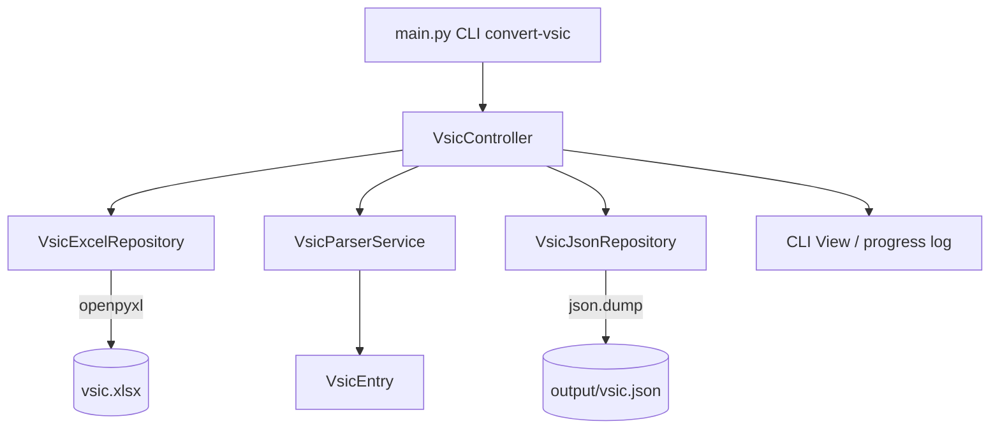

# System Design & Architecture

## Architecture Overview



**Key components:**
- `VsicController` — điều phối pipeline, nhận args từ CLI.
- `VsicExcelRepository` — đọc raw rows từ xlsx (openpyxl).
- `VsicParserService` — lọc rows invalid, convert code sang string, tính digits.
- `VsicJsonRepository` — ghi JSON ra file.
- `VsicEntry` (Pydantic model) — domain entity.

## Data Models

```python
# app/models/vsic_entry.py
class VsicEntry(BaseModel):
    code: str    # ví dụ "1110", "01100" — luôn là string
    title: str
    digits: int  # 4 hoặc 5
```

**Output JSON example:**
```json
[
  {"code": "1110", "title": "Trồng lúa", "digits": 4},
  {"code": "01100", "title": "Trồng cây lương thực khác", "digits": 5}
]
```

**Digits logic:** `digits = len(str(int(code)))` — file xlsx không có leading zeros nên không cần zfill.

## API Design

**CLI Interface:**
```bash
python3 main.py convert-vsic --input assets/vsic-vn/vsic.xlsx
python3 main.py convert-vsic --input assets/vsic-vn/vsic.xlsx --output output/vsic.json
```

Default output: `output/vsic.json` khi không truyền `--output`.

**Internal Protocol (services/protocols.py):**
```python
class VsicRepository(Protocol):
    def read_rows(self) -> List[dict]: ...

class VsicParser(Protocol):
    def parse(self, rows: List[dict]) -> List[VsicEntry]: ...
```

## Component Breakdown

| Layer | File | Responsibility |
|-------|------|----------------|
| Model | `app/models/vsic_entry.py` | `VsicEntry` Pydantic model |
| Service | `app/services/vsic_parser_service.py` | Lọc invalid rows, convert code → string, tính digits |
| Repository | `app/repositories/vsic_excel_repository.py` | Đọc xlsx bằng openpyxl |
| Repository | `app/repositories/vsic_json_repository.py` | Ghi JSON output |
| Controller | `app/controllers/vsic_controller.py` | Wiring + điều phối |
| Protocol | `app/services/protocols.py` | `VsicRepository`, `VsicParser` |

## Design Decisions

1. **openpyxl thay vì pandas** — ít dependency hơn, không cần numpy; đủ cho task đọc rows đơn giản.
2. **Flat array + digits thay vì nested tree** — dễ filter theo cấp độ mã ngành, không cần hierarchy inference.
3. **Digits tính bằng len(str(code))** — file xlsx không có leading zeros, không cần zfill.
4. **Protocol-based injection** — `VsicExcelRepository` implements `VsicRepository` protocol; dễ test với fake.
5. **Không có parent_code / level / hierarchy** — nằm ngoài scope, requirements xác nhận không cần.

## Non-Functional Requirements

- **Performance:** File xlsx ~743 rows — không cần streaming; load toàn bộ vào memory.
- **Error handling:** Log warning nếu row thiếu code/title, bỏ qua row đó.
- **Extensibility:** Protocol cho phép thêm `VsicDatabaseRepository` sau mà không sửa service.
