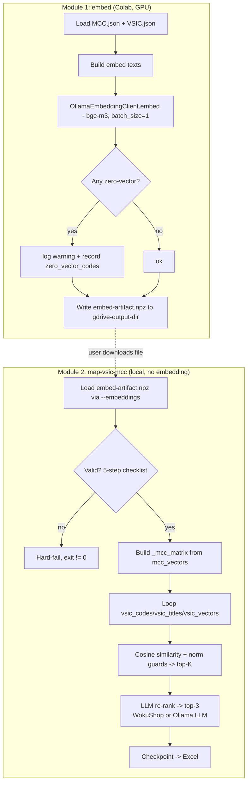

# System Design & Architecture — Split Embedding & LLM Re-rank

## Architecture Overview

Two independent modules in the same codebase, connected by one self-contained `.npz` artifact. Module 1 (`embed`) is a pure producer; Module 2 (`map-vsic-mcc`) is a pure consumer.



**Key change vs current flow:**
- Currently: MCC precompute loop + per-VSIC `embedding_client.embed()` inside `execute()`.
- After: embedding lives only in Module 1; `execute()` receives pre-loaded vectors + text and never embeds.

## Data Models

### Artifact file (`embed-artifact.npz`, self-contained)

```
embed-artifact.npz
├── mcc_vectors       np.float32 (91, 1024)
├── mcc_codes         object[]  (91,)   # MCC code strings
├── mcc_titles        object[]  (91,)
├── mcc_descriptions  object[]  (91,)
├── vsic_vectors      np.float32 (N, 1024)
├── vsic_codes        object[]  (N,)
├── vsic_titles       object[]  (N,)
└── meta              object    # JSON-encoded dict (see below)
```

### Meta structure

```json
{
  "dim": 1024,
  "zero_vector_codes": {"mcc": [], "vsic": ["8888"]},
  "embedding_model": "bge-m3",
  "created_at": "2026-06-19T10:00:00"
}
```

Meta is kept **minimal** (YAGNI — MCC/VSIC data is effectively static, so no format-drift risk):
- `dim` + `zero_vector_codes` are **functional** (used by Module 2 validation + warning).
- `embedding_model` + `created_at` are **labels only** — logged for debugging, never used to validate or branch.
- No `schema_version` / `mcc_source` / `vsic_source` fields.

### Save / load

```python
# Save (Module 1)
np.savez(
    path,
    mcc_vectors=mcc_vectors, mcc_codes=np.array(mcc_codes, dtype=object),
    mcc_titles=np.array(mcc_titles, dtype=object),
    mcc_descriptions=np.array(mcc_descriptions, dtype=object),
    vsic_vectors=vsic_vectors, vsic_codes=np.array(vsic_codes, dtype=object),
    vsic_titles=np.array(vsic_titles, dtype=object),
    meta=np.array(json.dumps(meta), dtype=object),
)

# Load (Module 2)
data = np.load(path, allow_pickle=True)
meta = json.loads(str(data["meta"]))
```

## API Design

### New repository: `EmbeddingArtifactRepository` (`app/repositories/embedding_artifact_repository.py`)

I/O layer for the artifact — keeps NumPy/file concerns out of services.

```python
class EmbeddingArtifactRepository:
    def write(self, path: Path, artifact: EmbeddingArtifact) -> None: ...
    def read(self, path: Path) -> EmbeddingArtifact: ...
        # Hard-fail checklist (checked in order, fail fast):
        #   1. file not found        -> FileNotFoundError
        #   2. not loadable / bad npz-> ValueError("corrupt or not a valid .npz")
        #   3. missing required key  -> ValueError(list of missing keys)
        #   4. wrong dimension       -> ValueError (mcc/vsic vectors.shape[1] != 1024)
        #   5. length mismatch       -> ValueError (len(codes) != vectors.shape[0])
```

### Artifact value object (`app/models/embedding_artifact.py`)

```python
@dataclass
class EmbeddingArtifact:
    mcc_vectors: np.ndarray          # (91, 1024)
    mcc_codes: list[str]
    mcc_titles: list[str]
    mcc_descriptions: list[str]
    vsic_vectors: np.ndarray         # (N, 1024)
    vsic_codes: list[str]
    vsic_titles: list[str]
    meta: dict
```

### Module 1 entry: `embed` subcommand (`main.py` + `EmbedController`)

```
python3 main.py embed \
  --mcc-input output/mcc-visa.json \
  --vsic-input output/vsic-vn.json \
  --output output/embed-artifact.npz \
  --gdrive-output-dir /content/drive/MyDrive/projects/mcc-lens \
  --ollama-host http://localhost:11434 \
  --embedding-model bge-m3
```

`EmbedController.execute()` → load JSON → build texts → `OllamaEmbeddingClient.embed` (batch_size=1) → collect zero-vector codes → `EmbeddingArtifactRepository.write()`.

#### Shared embed-text builder (`app/services/embed_text_builder.py`) — new

**Critical for the deterministic Stage-1 guarantee.** The exact text formulas currently embedded inside `MapVsicToMccUseCase` must be extracted to one shared module so Module 1 reproduces them byte-for-byte. Any divergence changes the vectors → changes cosine top-K → breaks the "Stage-1 identical" success criterion.

```python
def build_mcc_text(mcc: dict) -> str:
    # exactly matches current use_case logic
    title = strip_html(mcc["title"])
    description = strip_html(mcc.get("description") or "")
    return f"{title} — {description[:500]}"

def build_vsic_text(vsic: dict) -> str:
    # current behavior: RAW title, no strip_html, no truncation
    return vsic["title"]
```

Module 1 uses these to build embed inputs. `_strip_html` moves here (or is imported here) as the single source.

### Module 2 change: `MapVsicToMccUseCase` (consumer-only)

- Constructor drops `embedding_client`; accepts the loaded artifact instead. **No `vsic_entries: list[dict]` param** — the artifact is the sole source for both vectors and text (V2).

```python
def __init__(
    self,
    llm_client: LLMClient,
    checkpoint_repo: MappingCheckpointRepository,
    artifact: EmbeddingArtifact,
    validator: MccCodeValidator,
) -> None: ...
```

- `execute(top_k, resume, limit)`: build `_mcc_matrix` from `artifact.mcc_vectors`; iterate the processing loop over `zip(artifact.vsic_codes, artifact.vsic_titles, artifact.vsic_vectors)`; `--limit` slices this list (the artifact still holds the full set). No embedding call anywhere. MCC code/title/description for prompts come from the artifact arrays.
- **Zero-vector guards preserved (V6):** keep `_mcc_norms[_mcc_norms == 0] = 1.0` and `if vsic_norm == 0: vsic_norm = 1.0` so a zero vector yields cosine **0.0**, never NaN.
- `validator` is built from `artifact.mcc_codes` (not from source JSON).

### `MappingController.execute()` change

- New `--embeddings <path>` (default `output/embed-artifact.npz`); on Colab, defaults under `--gdrive-output-dir`.
- Drop `--vsic-input`/`--mcc-input` flags (artifact is the sole input).
- Load artifact via `EmbeddingArtifactRepository.read()`; on `FileNotFoundError`/`ValueError` → log error, return non-zero exit code.
- **Remove only the embedding side** — delete `WokuShopEmbeddingClient`/`OllamaEmbeddingClient` construction and the embedding health-check (`check_ollama_embedding`).
- **LLM provider stays dual (V3, option B):** both `ollama` and `wokushop` LLM providers remain selectable via `LLM_PROVIDER`.
  - `wokushop` → `WokuShopLLMClient.health_check()`.
  - `ollama` → `check_ollama_models()` reduced to **LLM model only** (no embedding model check, since embeddings now come from the artifact).
- The MCC `validator` and the VSIC processing list are derived from the loaded artifact, not from JSON.

## Component Breakdown

| Component | Change |
|-----------|--------|
| `app/models/embedding_artifact.py` (new) | `EmbeddingArtifact` dataclass |
| `app/repositories/embedding_artifact_repository.py` (new) | `.npz` read/write + validation (dim, non-empty) |
| `app/controllers/embed_controller.py` (new) | Module 1 orchestration |
| `app/services/embed_text_builder.py` (new) | Shared `build_mcc_text`/`build_vsic_text` + `strip_html` — single source so Module 1 reproduces vectors byte-for-byte (deterministic Stage-1) |
| `app/services/map_vsic_to_mcc_use_case.py` | Drop `EmbeddingClient` + `vsic_entries` param; consume artifact; loop over artifact arrays; keep norm guards; validator from artifact |
| `app/controllers/mapping_controller.py` | Load artifact; add `--embeddings`, drop `--vsic-input`/`--mcc-input`; drop embedding client + embedding health-check; keep dual LLM provider (ollama LLM health-check reduced to LLM model only) |
| `main.py` | Add `embed` subcommand + args; add `--embeddings` to `map-vsic-mcc` |
| `app/repositories/wokushop_embedding_client.py` | Remove (now unused) |
| `.gitignore` | Add `output/*.npz` (and Drive artifact ignored implicitly) |
| `README.md` / `CLAUDE.md` | Document 2-stage Colab→local workflow |

## Design Decisions

| Decision | Choice | Rationale |
|----------|--------|-----------|
| Coupling | 2 modules, 1 artifact | Run embedding on Colab GPU, re-rank locally on WokuShop; no Ollama locally |
| Artifact format | Self-contained `.npz` | Single download; no source-JSON version drift; ~few MB overhead |
| Embed packaging | `main.py` subcommand | Reuses argparse/loguru/config; consistent with other commands; runs on Colab & local |
| Missing/corrupt artifact | Hard-fail | Artifact is source of truth; silent fallback would hide wrong input |
| Zero-vector policy | Write + warn + record in meta | Matches resilient current behavior; 1 NaN ≠ full re-embed |
| Embedding abstraction in Module 2 | Removed | Consumer-only; no embedding client needed |
| Artifact dim | 1024 (bge-m3) | Validated against `meta.dim`; mismatch → hard-fail |
| Module 2 LLM provider | Keep both ollama + wokushop | Only the embedding side is removed; user may still re-rank via local Ollama LLM to avoid WokuShop cost |
| Embed-text logic | Extracted to shared `embed_text_builder` | Guarantees Module 1 reproduces vectors byte-for-byte → deterministic Stage-1 top-K |
| Artifact meta | Minimal (`dim` + `zero_vector_codes` + label fields) | YAGNI — static source data, no version-drift risk |

## Non-Functional Requirements

**Performance:**
- Module 2 has no embedding phase — only `np.load` + cosine + LLM calls.
- Storage: `(91 + N) × 1024 × 4 bytes` + text ≈ a few MB (e.g. N=2000 → ~17 MB).

**Reliability:**
- Module 2 validates artifact (dim, non-empty) before any mapping; fail-fast on bad input.
- `np.savez` writes complete or fail cleanly.

**Security:**
- Artifact holds only vectors + public industry text — no PII/secrets.
- `.gitignore` prevents committing `.npz`; WokuShop key stays in `.env`.
