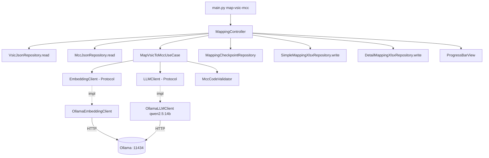

# System Design & Architecture

## Architecture Overview

Pipeline offline chạy local, tuân thủ Clean Architecture + MVC của project. Inference gọi Ollama HTTP API (`localhost:11434`). Chiến lược 2-stage retrieval giúp cắt giảm token và độ trễ:



**Key components & responsibilities:**

- **Presentation** — `main.py` subcommand `map-vsic-mcc`; `ProgressBarView` wrap `tqdm`.
- **Controller** — `app/controllers/mapping_controller.py`: parse args, wire dependencies, gọi use case, map exit code.
- **Use case / Service** — `app/services/map_vsic_to_mcc_use_case.py`: orchestrate 2-stage mapping; `app/services/mcc_code_validator.py`: validate LLM output.
- **Abstractions** — `app/services/protocols.py` bổ sung `EmbeddingClient` và `LLMClient`.
- **Infrastructure** — `app/repositories/ollama_llm_client.py`, `app/repositories/ollama_embedding_client.py`, `app/repositories/simple_mapping_xlsx_repository.py`, `app/repositories/detail_mapping_xlsx_repository.py`, `app/repositories/mapping_checkpoint_repository.py`. (VsicJsonRepository / MccJsonRepository đã có sẵn từ feature trước — tái sử dụng.)
- **Models** — `app/models/mapping_entry.py` (DTO trung gian).

**Technology stack:**

- Python 3.8+, tuân thủ `requirements.txt`.
- `ollama` (Python client) cho cả chat + embeddings.
- `openpyxl` (đã có) để ghi xlsx.
- `tqdm` (đã có) cho progress bar.
- `pydantic` (đã có) cho DTO.

## Data Models

**Input: `output/vsic-vn.json`** (đã có, wrapped):

```json
{"source": "...", "total_vsic_count": 743, "vsic_list": [
  {"code": "1110", "title": "Trồng lúa", "level": 4, "parent_code": null, "description": ""}
]}
```

Chỉ dùng field `title` (tiếng Việt) cho embedding và prompt LLM.

**Input: `output/mcc-visa.json`** (đã có, wrapped):

```json
{"source": "...", "total_mcc_count": 903, "mcc_list": [
  {"mcc": "5411", "title": "Grocery Stores, Supermarkets", "description": "...", ...}
]}
```

Chỉ dùng `title` + `description` cho embedding và prompt LLM. Bỏ qua `included_in_mcc`, `similar_merchants`, `source_image`.

**Intermediate DTO — `MappingEntry`:**

```python
class RankedMcc(BaseModel):
    mcc_code: str
    mcc_title: str
    score: float        # cosine similarity từ embedding, thứ tự sắp xếp theo LLM chọn
    comment: str        # 1 câu ngắn do LLM sinh ra

class MappingEntry(BaseModel):
    vsic_code: str
    vsic_title: str             # tiếng Việt, copy từ input
    top_results: list[RankedMcc]  # len 1-3, empty = NO_MATCH
```

**Output 1 — `output/vsic-mcc-mapping.xlsx`** (simple, 3 cột):

| VSIC | MCC | Tên ngành |
|---|---|---|
| 1110 | 5199 | Trồng lúa |

MCC = `top_results[0].mcc_code` (hoặc rỗng nếu NO_MATCH).

**Output 2 — `output/vsic-mcc-mapping-detail.xlsx`** (dùng template `assets/template/vsic_mcc_mapping_template.xlsx`):

- Sheet **"Mapping Result"**: điền 14 cột — Mã VSIC, Tên Ngành (Tiếng Việt), + 4 cột × 3 rank (Mã MCC, Tên MCC, Score, Nhận xét).
- Sheet **"Hướng Dẫn"**: giữ nguyên từ template (không chỉnh sửa).
- Sheet **"Thống Kê"**: giữ nguyên công thức từ template (không chỉnh sửa).

**Checkpoint file — `output/.mapping-progress.json`:**

```json
{"completed": {"1110": {"top_results": [
  {"mcc_code": "5199", "mcc_title": "...", "score": 0.82, "comment": "..."},
  {"mcc_code": "5411", "mcc_title": "...", "score": 0.74, "comment": "..."},
  {"mcc_code": "5912", "mcc_title": "...", "score": 0.61, "comment": "..."}
]}}}
```

## API Design

**Không có HTTP API.** CLI:

```bash
python3 main.py map-vsic-mcc \
  [--vsic-input output/vsic-vn.json] \
  [--mcc-input output/mcc-visa.json] \
  [--output output/vsic-mcc-mapping.xlsx] \
  [--output-detail output/vsic-mcc-mapping-detail.xlsx] \
  [--top-k 15] \
  [--ollama-host http://localhost:11434] \
  [--llm-model qwen2.5:14b] \
  [--embedding-model bge-m3] \
  [--resume]
```

**Internal interfaces (Protocols) — thêm vào `app/services/protocols.py`:**

```python
class EmbeddingClient(Protocol):
    def embed(self, texts: list[str]) -> list[list[float]]: ...

class LLMClient(Protocol):
    def chat(self, system: str, user: str, *, temperature: float = 0.0) -> str: ...

class MappingCheckpointRepository(Protocol):
    def load(self) -> dict[str, dict]: ...
    def save(self, vsic_code: str, result: dict) -> None: ...
```

**Exit codes:**

- `0` success
- `1` file not found / bad schema / generic
- `2` Ollama unavailable hoặc model chưa pull
- `3` IO error khi ghi xlsx

## Component Breakdown

**Backend modules (Python, layered):**

- `app/models/mapping_entry.py` — pydantic DTO `RankedMcc` + `MappingEntry`.
- `app/services/protocols.py` — bổ sung `EmbeddingClient`, `LLMClient`, `MappingCheckpointRepository`.
- `app/services/map_vsic_to_mcc_use_case.py` — orchestration:
  1. Precompute embeddings của tất cả MCC (title + description concat, 1 lần).
  2. Với mỗi VSIC chưa done: embed title → cosine sim.
  3. Áp dụng Adaptive Top-K Escalation: Lấy `top_k` candidates → LLM re-rank. Nếu LLM trả kết quả rỗng hoặc top-1 score < 0.5, tự động nhân đôi `top_k` (giới hạn max e.g. 100) và gọi lại LLM.
  4. Validate kết quả → lưu checkpoint.
- `app/services/mcc_code_validator.py` — check MCC code có trong danh sách hợp lệ, fallback top-1 embedding nếu LLM hallucinate.
- `app/repositories/ollama_llm_client.py` — wrap `ollama.chat()`, retry, timeout.
- `app/repositories/ollama_embedding_client.py` — wrap `ollama.embed()`, batch.
- `app/repositories/simple_mapping_xlsx_repository.py` — ghi file simple 3 cột bằng `openpyxl`.
- `app/repositories/detail_mapping_xlsx_repository.py` — load template, điền sheet "Mapping Result" (14 cột), giữ nguyên 2 sheet còn lại.
- `app/repositories/mapping_checkpoint_repository.py` — atomic write JSON.
- `app/controllers/mapping_controller.py` — wire dependencies, điều phối.
- `app/views/progress_bar_view.py` — **tái sử dụng** nếu interface phù hợp.

**Third-party integrations:**

- Ollama HTTP API qua thư viện `ollama` Python (thêm vào `requirements.txt`).
- Nếu user chưa pull `bge-m3` → raise với hướng dẫn `ollama pull bge-m3`.

## Design Decisions

- **2-stage retrieval với Adaptive Top-K**: gửi 903 MCC cho Qwen2.5:14b trong 1 prompt sẽ vượt context comfortable, tốn token × 743 VSIC. Pre-filter mặc định top-15 giảm ~60 lần token. Trade-off: nếu embedding miss → LLM không có cơ hội chọn đúng. Mitigation: Áp dụng cơ chế **Adaptive Top-K Escalation**, tự động nhân đôi `top_k` (15 → 30 → 60) cho các ca khó (LLM trả rỗng hoặc score < 0.5) thay vì dùng 1 mức `top_k` lớn cho toàn bộ, giúp cân bằng giữa độ chính xác và chi phí token.
- **Score = cosine similarity, thứ tự = LLM**: giữ score khách quan từ embedding, nhưng để LLM quyết định rank cuối cùng dựa trên ngữ nghĩa sâu hơn. Trade-off: score không phản ánh tuyệt đối "độ chắc chắn" của LLM, nhưng đơn giản hơn và không cần thêm lần gọi.
- **2 file Excel riêng biệt**: simple file cho downstream pipeline, detail file cho human review. Không dùng sheet ẩn.
- **Ollama làm backend duy nhất cho cả LLM + embedding**: giảm phụ thuộc, không cần GPU/CUDA, chạy MPS native trên M1.
- **Checkpoint per-VSIC JSON** thay vì SQLite: đơn giản, đủ nhanh với 743 rows.
- **Protocol-based DI**: service depend on abstractions → test với `FakeLLMClient`/`FakeEmbeddingClient`.
- **Alternatives đã cân nhắc:**
  - (a) Gửi cả 903 MCC trong 1 prompt → loại vì token cost & chất lượng không hơn top-15.
  - (b) Dùng `sentence-transformers` trực tiếp → loại vì user đã chuẩn hoá quanh Ollama.
  - (c) Single-stage chỉ embedding, không LLM → loại vì chất lượng mapping ngữ nghĩa yếu.
  - (d) OpenAI/Claude API → loại vì yêu cầu offline.

## Non-Functional Requirements

- **Performance:** Mục tiêu ≤ 3h cho toàn bộ 743 VSIC trên M1 16GB (≈ 15s/VSIC = embed 0.2s + LLM ≈ 14s cho Qwen2.5:14b với 15 candidates).
- **Resource:** RAM tối đa ~11GB (Qwen 14B ~9GB + Python ~1.5GB). Không chạy song song nhiều VSIC để tránh OOM.
- **Reliability:** Checkpoint flush sau MỖI VSIC → kill -9 cũng chỉ mất 1 entry. `--resume` đọc checkpoint, skip completed.
- **Security:** Không có secret / API key. Chỉ localhost. Không log full prompt khi debug bật.
- **Observability:** `loguru` log level INFO mặc định; DEBUG log top-K + LLM raw response khi `LOG_LEVEL=DEBUG`.
- **Compatibility:** Python 3.8+, macOS (M1/M2); Linux nên cũng chạy được vì chỉ phụ thuộc HTTP Ollama.
