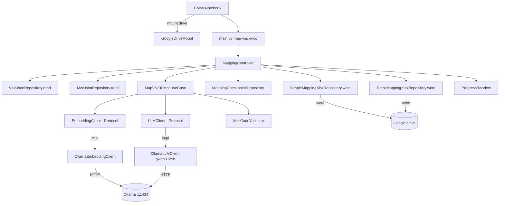

# System Design & Architecture

## Architecture Overview

Pipeline chạy trên Google Colab (GPU NVIDIA), tuân thủ Clean Architecture + MVC. Ollama chạy local trong runtime Colab, dữ liệu output được ghi lên Google Drive đã mount.



**Key components & responsibilities:**

- **Colab Notebook** — mount Google Drive, start Ollama service, chạy CLI.
- **Controller** — parse args, wire dependencies, điều phối use case và output.
- **Use case** — orchestration 2-stage mapping (embedding pre-filter → LLM rerank).
- **Repositories** — đọc JSON, ghi Excel, checkpoint.
- **Protocols** — `EmbeddingClient`, `LLMClient`, `MappingCheckpointRepository`.

## Data Models

**Input: `output/vsic-vn.json`**

- `vsic_list[]`: `{code, title, level, parent_code, description}`
- Dùng `title` (tiếng Việt) cho embedding + prompt.

**Input: `output/mcc-visa.json`**

- `mcc_list[]`: `{mcc, title, description, ...}`
- Dùng `title` + `description` cho embedding + prompt.

**Intermediate DTO — `MappingEntry`:**

- `vsic_code`, `vsic_title`, `top_results` (1–3 entries).

**Outputs (Google Drive):**

- `projects/mcc-lens/vsic-mcc-mapping.xlsx` (3 cột).
- `projects/mcc-lens/vsic-mcc-mapping-detail.xlsx` (template 14 cột).

**Checkpoint:**

- `projects/mcc-lens/.mapping-progress.json` (đề xuất).

## API Design

**CLI (không HTTP API):**

```bash
python3 main.py map-vsic-mcc \
  [--vsic-input output/vsic-vn.json] \
  [--mcc-input output/mcc-visa.json] \
  [--gdrive-output-dir /content/drive/MyDrive/projects/mcc-lens] \
  [--top-k 60] \
  [--ollama-host http://localhost:11434] \
  [--llm-model qwen3.5:9b] \
  [--embedding-model bge-m3] \
  [--resume]
```

*(Lưu ý: Khi sử dụng `--gdrive-output-dir`, các file `vsic-mcc-mapping.xlsx`, `vsic-mcc-mapping-detail.xlsx` và `.mapping-progress.json` sẽ tự động được lưu vào thư mục này. Người dùng vẫn có thể ghi đè bằng các cờ `--output`, `--output-detail` và `--checkpoint` nếu cần thiết).*

## Component Breakdown

- `app/controllers/mapping_controller.py` — hỗ trợ cấu hình output path thông qua `--gdrive-output-dir`.
- `app/services/map_vsic_to_mcc_use_case.py` — logic 2-stage, checkpoint-aware.
- `app/repositories/simple_mapping_xlsx_repository.py` — ghi file Excel simple.
- `app/repositories/detail_mapping_xlsx_repository.py` — ghi file detail theo template.
- `app/repositories/mapping_checkpoint_repository.py` — checkpoint lưu trên Drive.
- `colab/mapping_vsic_mcc_colab.ipynb` — notebook mẫu để mount drive + setup Ollama + chạy CLI.

## Design Decisions

- **Colab GPU + Ollama:** tận dụng GPU để tăng tốc so với local, giảm thời gian chạy.
- **Model qwen3.5:9b:** cân bằng tốc độ và chất lượng trên GPU T4/L4.
- **Output trực tiếp lên Drive:** tránh mất dữ liệu khi runtime reset.
- **Checkpoint trên Drive:** resume sau khi Colab reset.
- **Không thêm UI:** giữ pipeline CLI để tái sử dụng logic hiện tại.

## Non-Functional Requirements

- **Performance:** mục tiêu ≤ 2h cho 743 VSIC trên GPU T4 (ước lượng).
- **Reliability:** checkpoint flush sau mỗi VSIC; resume an toàn.
- **Security:** không có secrets; chỉ local Ollama + Google Drive mount.
- **Compatibility:** Python 3.8+, Colab Linux runtime.
